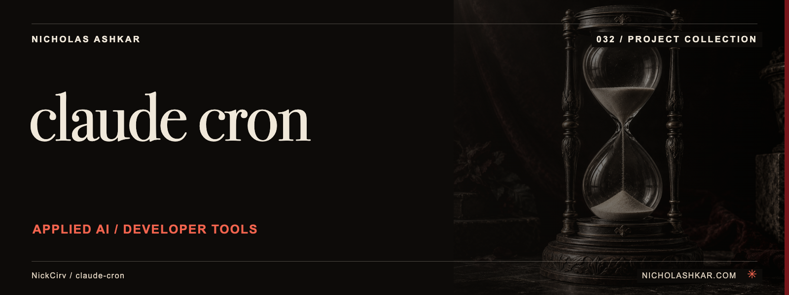

# claude-cron

Schedules recurring prompts for an installed Claude CLI and keeps local execution logs.


<a id="usage"></a>

<a id="add-a-daily-9am-dependency-audit"></a>

<a id="check-whats-running"></a>

## What it does

- Cron-expression validation.
- Named tasks.
- Manual runs.
- Background/foreground scheduler.
- Per-task execution history.


<a id="install"></a>

<a id="start-the-background-daemon"></a>

## Quickstart

Prerequisites: Node.js `>=18.0.0` and npm. The checkout below pins the source used for this documentation.

```sh
git clone https://github.com/NickCirv/claude-cron.git
cd claude-cron
git checkout 827c3d37a5857668bcf6e6e023dc70d5d8bc09b2
npm install
node bin/cron.js list
```

**Expected behavior (illustrative, not captured):** Lists locally configured tasks without creating a schedule.

Examples are source-inspected, **not runtime-tested**. See the research record for verification gaps.

## Boundaries and data

Running a task invokes Claude in its configured working directory and can change that project. The daemon must remain running for scheduled execution. Authentication and current CLI compatibility are unverified.


<a id="add-a-weekly-report-monday-8am-in-a-specific-project-directory"></a>

## Development

The manifest defines `npm test` as:

```sh
node --test
```

The captured suite is a smoke check, not end-to-end behavior coverage. Examples include “entry is valid JavaScript”. Tests were not run for this documentation revision.

See [implementation and command reference](docs/REFERENCE.md) for the package scripts and inspected interfaces, and [research record](docs/RESEARCH.md) for the pinned source, document decisions and unresolved checks.

## License and contact

See [LICENSE](LICENSE) for the original terms and attribution. Legal text is unchanged.

[Nicholas Ashkar](https://nicholashkar.com/) · [Discuss a project](https://nicholashkar.com/#oxblood-contact)
